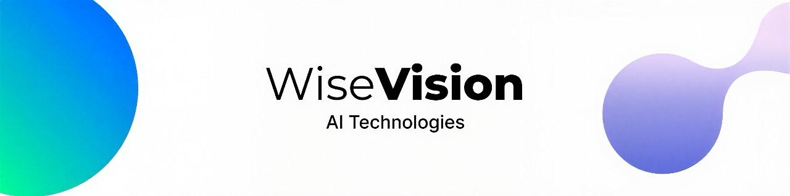

<h4>WiseVision Technologies, founded in 2022, is a company specialized in building AI solutions mainly for the retail sector, we use computer vision and machine learning to analyse the customer behaviour inside our stores then merge this data to the sales history in order to evaluate the pertinence of the proposed assortment.
Our team is ready to help. </h4>

  

- 📫 How to reach us *admin@wisevision.io*

<h3 align="left">Connect with uq:</h3>

<h3 align="left">Languages and Tools:</h3>

                  

